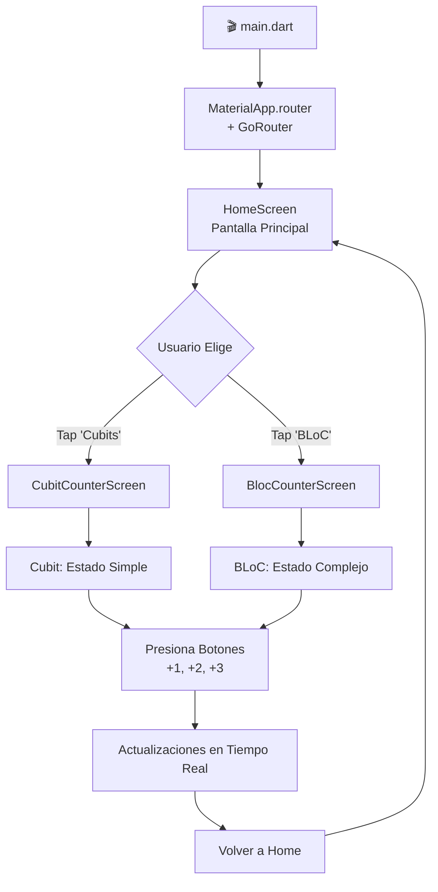

# 📚 Documentación Completa - FormsApp (BLoC & Cubits)

## 🎯 ¿Qué es este Proyecto?

**FormsApp** es una aplicación educativa de Flutter diseñada para enseñar y demostrar dos patrones principales de **gestión de estado**:

1. **Patrón Cubit** - Gestión de estado simple y directa
2. **Patrón BLoC** - Gestión de estado avanzada con eventos

La aplicación implementa un simple **contador** usando ambos patrones para que puedas comparar y entender las diferencias entre ellos.

---

## 🏗️ Propósito Educativo

Este proyecto es un **material de formación** que responde estas preguntas:

- ¿Cuál es la diferencia entre BLoC y Cubit?
- ¿Cómo gestionar estado en Flutter de forma escalable?
- ¿Cuándo usar BLoC y cuándo usar Cubit?
- ¿Cómo estructurar una aplicación Flutter profesional?

---

## 🏛️ Arquitectura General del Proyecto

```
lib/
├── main.dart                          # Punto de entrada de la aplicación
├── config/
│   ├── router/
│   │   └── app_router.dart           # Configuración de rutas (GoRouter)
│   └── theme/
│       └── app_theme.dart            # Tema Material Design
└── presentation/
    ├── blocs/                         # Lógica de estado
    │   ├── counter_bloc/              # Implementación del patrón BLoC
    │   │   ├── counter_bloc.dart
    │   │   ├── counter_event.dart
    │   │   └── counter_state.dart
    │   └── counter_cubit/             # Implementación del patrón Cubit
    │       ├── counter_cubit.dart
    │       └── counter_state.dart
    └── screens/                       # UI y widgets
        ├── home_screen.dart           # Pantalla principal
        ├── bloc_counter_screen.dart   # Demo del patrón BLoC
        ├── cubit_counter_screen.dart  # Demo del patrón Cubit
        └── screens.dart               # Archivo barrel
```

---

## 🔄 Flujos de Datos

### Cubit - Flujo Directo
```
User Action → Cubit Method → emit(new state) → UI Rebuild
```

**Ejemplo**: Usuario toca "+3"
1. `onPressed: () => increaseCounterBy(context, 3)`
2. `context.read<CounterCubit>().increaseBy(3)`
3. `emit(state.copyWith(counter: 8, transactionCount: 1))`
4. Widgets se reconstruyen con el nuevo estado

### BLoC - Flujo con Eventos
```
User Action → Event → EventHandler → emit(new state) → UI Rebuild
```

**Ejemplo**: Usuario toca "+3"
1. `onPressed: () => increaseCounterBy(context, 3)`
2. `context.read<CounterBloc>().increaseBy(3)`
3. `add(CounterIncreased(3))`
4. `_onCounterIncreased()` procesa el evento
5. `emit(state.copyWith(counter: 13, transactionCount: 1))`
6. Widgets se reconstruyen con el nuevo estado

---

## 📱 Funcionalidades de la Aplicación

### Pantalla Principal (HomeScreen)
- **Propósito**: Menú de selección
- **Opciones**: 
  - Ir a demo de Cubits
  - Ir a demo de BLoC
- **Tecnología**: GoRouter para navegación

### Pantalla Cubit (CubitCounterScreen)
- **Estado inicial**: contador = 5
- **Funciones**:
  - ✅ Incrementar +1, +2, o +3
  - 🔄 Resetear a 0
  - 📊 Ver cantidad de transacciones
- **Métodos de estado**:
  - `increaseBy(int value)` - Incrementa directamente
  - `reset()` - Resetea a 0

### Pantalla BLoC (BlocCounterScreen)
- **Estado inicial**: contador = 10
- **Funciones**:
  - ✅ Incrementar +1, +2, o +3
  - 🔄 Resetear a 0
  - 📊 Ver cantidad de transacciones
- **Métodos con eventos**:
  - `increaseBy(int value)` - Agrega evento CounterIncreased
  - `resetCounter()` - Agrega evento CounterReset

---

## 🔍 Análisis Técnico Detallado

### 1️⃣ Estado (State)

Ambos patrones usan una clase `CounterState` similar:

**Propiedades**:
- `counter: int` - Valor actual del contador
- `transactionCount: int` - Número de cambios realizados

**Método especial**:
- `copyWith()` - Crea una copia inmutable con cambios específicos

**Ejemplo de uso**:
```dart
// Incrementar de 10 a 13
final newState = state.copyWith(
  counter: state.counter + 3
);
// El resto de propiedades se mantienen igual
```

**Por qué Equatable**: 
- Permite comparación de igualdad por valores, no por referencia
- Permite que flutter_bloc sepa cuándo rebuild es necesario

### 2️⃣ Cubit Explicado

**¿Qué es?**: Clase que extiende `Cubit<T>` donde T es el tipo de estado

**Estructura**:
```dart
class CounterCubit extends Cubit<CounterState> {
  CounterCubit() : super(const CounterState(counter: 5));
  
  void increaseBy(int value) {
    emit(state.copyWith(counter: state.counter + value));
  }
}
```

**Características**:
- ✅ Simple y directo
- ✅ Métodos públicos que modifican estado
- ✅ Usa `emit()` para emitir nuevo estado
- ✅ No hay una capa de eventos intermedia

**Casos de uso ideales**:
- Formularios simples
- Contadores
- Estados booleanos (visibilidad, etc)
- Aplicaciones pequeñas a medianas

### 3️⃣ BLoC Explicado

**¿Qué es?**: Clase que extiende `Bloc<Event, State>` que lidia con eventos

**Estructura**:
```dart
class CounterBloc extends Bloc<CounterEvent, CounterState> {
  CounterBloc() : super(const CounterState()) {
    on<CounterIncreased>(_onCounterIncreased);
    on<CounterReset>(_onCounterReset);
  }
  
  Future<void> _onCounterIncreased(
    CounterIncreased event,
    Emitter<CounterState> emit
  ) {
    emit(state.copyWith(counter: state.counter + event.value));
  }
}
```

**Componentes**:
1. **Eventos**: `CounterEvent` - Qué quiere hacer el usuario
   - `CounterIncreased(value)` - Aumentar contador
   - `CounterReset()` - Resetear contador

2. **Manejadores**: Métodos que procesan eventos
   - `_onCounterIncreased()` - Maneja incremento
   - `_onCounterReset()` - Maneja reset

3. **Estado**: `CounterState` - Resultado después de procesar evento

**Características**:
- 📋 Separación clara entre eventos y lógica
- 📊 Fácil de testear (cada evento tiene su test)
- 🔍 Trazabilidad de todas las acciones (auditoria)
- ♾️ Escalable a lógica compleja
- 🚀 Mejor para aplicaciones grandes

**Casos de uso ideales**:
- Autenticación y flujos complejos
- Aplicaciones grandes con lógica complicada
- Cuando necesitas auditoría de cambios
- Equipos grandes donde trazabilidad es importante

---

## 🎮 Cómo Usar la Aplicación

### Ejecución
```bash
flutter pub get
flutter run
```

### Navegación
1. **Inicia**: Verás HomeScreen con dos opciones
2. **Opción 1**: Tap en "Cubits" → CubitCounterScreen
3. **Opción 2**: Tap en "BLoC" → BlocCounterScreen
4. **Volver**: System back button o usando navigation stack

### Interacción
- **Botones +1, +2, +3**: Incrementan el contador
- **Ícono refresh**: Resetea contador a 0
- **AppBar**: Muestra número de transacciones realizadas
- **Body**: Muestra valor actual del contador

---

## 📊 Comparativa: Cubit vs BLoC

| Aspecto | Cubit | BLoC |
|--------|-------|------|
| **Complejidad** | ⭐ Baja | ⭐⭐⭐ Media-Alta |
| **Boilerplate** | ⭐⭐ Bajo | ⭐⭐⭐⭐ Alto |
| **Escalabilidad** | ⭐⭐⭐ Media | ⭐⭐⭐⭐⭐ Muy Alta |
| **Testeabilidad** | ⭐⭐⭐ Buena | ⭐⭐⭐⭐⭐ Excelente |
| **Aprendizaje** | ⭐⭐⭐⭐⭐ Fácil | ⭐⭐⭐ Complejo |
| **Performance** | ⭐⭐⭐⭐ Bueno | ⭐⭐⭐⭐⭐ Excelente |
| **Mantenibilidad** | ⭐⭐⭐⭐ Buena | ⭐⭐⭐⭐ Buena |

---

## 🎓 Conceptos Clave Explicados

### BlocProvider
Container que proporciona una instancia de BLoC/Cubit a los widgets descendientes.

```dart
BlocProvider(
  create: (_) => CounterCubit(),      // Crea la instancia
  child: const _CubitCounterView()    // Acceso a ella aquí
)
```

### context.read()
Obtiene la instancia del BLoC/Cubit **sin escuchar cambios**.

```dart
context.read<CounterCubit>().increaseBy(3);  // Acción sin rebuild
```

**Uso**: Acciones (botones, métodos que modifican estado)

### context.watch()
Obtiene la instancia del BLoC/Cubit **y escucha todos los cambios**.

```dart
final state = context.watch<CounterCubit>().state;
// Se reconstruye cuando ANY propiedad de state cambia
```

**Uso**: Mostrar datos (textos, listas)

### context.select()
Obtiene una **propiedad específica** del estado y escucha solo esa propiedad.

```dart
context.select((CounterCubit cubit) => cubit.state.counter)
// Se reconstruye solo cuando counter cambia, no transactionCount
```

**Uso**: Optimización - mostrar datos específicos sin reconstruir todo

### BlocBuilder
Widget que reconstruye su contenido cuando el estado cambia.

```dart
BlocBuilder<CounterCubit, CounterState>(
  builder: (context, state) {
    return Text('Counter: ${state.counter}');
  }
)
```

En código comentado hay `buildWhen` para control fino.

---

## 📁 Descripción de Archivos en Presentation

### Blocs (Gestión de Estado)

#### [Counter BLoC](lib/presentation/blocs/counter_bloc/counter_bloc.dart)
- **Función**: Define la lógica principal del patrón BLoC
- **Responsabilidad**: Procesar eventos y emitir estados
- **Métodos**: `increaseBy()`, `resetCounter()`

#### [Counter Events](lib/presentation/blocs/counter_bloc/counter_event.dart)
- **Función**: Define eventos que pueden ocurrir
- **Eventos**:
  - `CounterIncreased(int value)` - Pedir incremento
  - `CounterReset()` - Pedir reset

#### [Counter BLoC State](lib/presentation/blocs/counter_bloc/counter_state.dart)
- **Función**: Define estado para BLoC
- **Estado**: `counter` + `transactionCount`
- **Método**: `copyWith()` para inmutabilidad

#### [Counter Cubit](lib/presentation/blocs/counter_cubit/counter_cubit.dart)
- **Función**: Implementación del patrón Cubit
- **Simplificación**: Métodos directos sin eventos
- **Métodos**: `increaseBy()`, `reset()`

#### [Counter Cubit State](lib/presentation/blocs/counter_cubit/counter_state.dart)
- **Función**: Define estado para Cubit
- **Estado**: `counter` (inicial 0) + `transactionCount`
- **Similar al BLoC**: Pero con valores iniciales diferentes

### Screens (Interfaz de Usuario)

#### [HomeScreen](lib/presentation/screens/home_screen.dart)
- **Función**: Pantalla principal/menú
- **Contenido**: Lista con opciones de navegación
- **Navegación**: GoRouter para cambiar pantallas
- **Estado**: Ninguno (StatelessWidget puro)

#### [BLoC Counter Screen](lib/presentation/screens/bloc_counter_screen.dart)
- **Función**: Demostración del patrón BLoC
- **Clases**: `BlocCounterScreen` + `BlocCounterView`
- **Estado**: Usa CounterBloc
- **Interacción**: Eventos mediante botones
- **Optimización**: context.select() para eficiencia

#### [Cubit Counter Screen](lib/presentation/screens/cubit_counter_screen.dart)
- **Función**: Demostración del patrón Cubit
- **Clases**: `CubitCounterScreen` + `_CubitCounterView`
- **Estado**: Usa CounterCubit
- **Interacción**: Métodos directos sin eventos
- **Optimización**: BlocBuilder para control fino

#### [Screens Barrel](lib/presentation/screens/screens.dart)
- **Función**: Archivo índice que exporta todas las screens
- **Patrón**: Barrel pattern para imports limpios
- **Exports**:
  - BlocCounterScreen
  - CubitCounterScreen
  - HomeScreen

---

## ⚙️ Configuración del Proyecto

### [Router (GoRouter)](lib/config/router/app_router.dart)
Define las rutas de navegación:
- `/` → HomeScreen
- `/cubits` → CubitCounterScreen
- `/counter-bloc` → BlocCounterScreen

### [Theme (AppTheme)](lib/config/theme/app_theme.dart)
Configuración visual:
- Material Design 3
- Color seed: Deep Purple
- Tema consistente para toda la app

### [Main Entry Point](lib/main.dart)
Punto de entrada:
- Configura MaterialApp.router con GoRouter
- Aplica tema global
- Deshabilita banner de debug

---

## 📦 Dependencias Principales

| Paquete | Versión | Propósito |
|---------|---------|-----------|
| **flutter_bloc** | 8.1.2 | Estado management (BLoC & Cubit) |
| **go_router** | 6.2.0 | Navegación y routing |
| **equatable** | 2.0.5 | Comparación de objetos por valor |

---

## 🚀 Flujo de la Aplicación



---

## 💡 Lecciones Aprendidas

### 1. Cubit es más simple
- Para casos simples, Cubit es suficiente
- Reduce boilerplate significativamente
- Más fácil de entender para principiantes

### 2. BLoC es más poderoso
- Excelente para aplicaciones complejas
- Facilita testing y debugging
- Proporciona una arquitectura clara

### 3. Importancia de la inmutabilidad
- Los estados deben ser inmutables
- `copyWith()` es la forma de "modificar" estados
- Equatable permite comparación eficiente

### 4. Optimización con context.select()
- Evita reconstrucciones innecesarias
- Mejora performance en aplicaciones grandes
- context.watch() reconstruye todo, select() es más fino

### 5. Patrón Barrel para imports
- Centraliza exportaciones
- Mejora mantenibilidad
- Reduce complejidad de imports en otros archivos

---

## 🔗 Referencias de Documentación por Archivo

### Documentación Detallada en Código

Cada archivo de `presentation/` contiene documentación inline con:
- ✅ Función del archivo
- ✅ Para qué sirve
- ✅ Explicación técnica detallada de sus partes

**Archivos documentados**:

#### Gestión de Estado (BLoC)
- [lib/presentation/blocs/counter_bloc/counter_bloc.dart](lib/presentation/blocs/counter_bloc/counter_bloc.dart) - Lógica principal del BLoC
- [lib/presentation/blocs/counter_bloc/counter_event.dart](lib/presentation/blocs/counter_bloc/counter_event.dart) - Definición de eventos
- [lib/presentation/blocs/counter_bloc/counter_state.dart](lib/presentation/blocs/counter_bloc/counter_state.dart) - Definición de estado

#### Gestión de Estado (Cubit)
- [lib/presentation/blocs/counter_cubit/counter_cubit.dart](lib/presentation/blocs/counter_cubit/counter_cubit.dart) - Implementación del Cubit
- [lib/presentation/blocs/counter_cubit/counter_state.dart](lib/presentation/blocs/counter_cubit/counter_state.dart) - Estado del Cubit

#### Pantallas (UI)
- [lib/presentation/screens/home_screen.dart](lib/presentation/screens/home_screen.dart) - Pantalla principal
- [lib/presentation/screens/bloc_counter_screen.dart](lib/presentation/screens/bloc_counter_screen.dart) - Demo BLoC
- [lib/presentation/screens/cubit_counter_screen.dart](lib/presentation/screens/cubit_counter_screen.dart) - Demo Cubit
- [lib/presentation/screens/screens.dart](lib/presentation/screens/screens.dart) - Barrel de screens

---

## 🎯 Próximos Pasos de Aprendizaje

1. **Comprende Cubit primero**: Es el patrón base más simple
2. **Estudia BLoC después**: Construye sobre conceptos de Cubit
3. **Experimenta**: Modifica el código y ve qué pasa
4. **Escala**: Intenta agregar más features al proyecto
5. **Testing**: Escribir pruebas para BLoC/Cubit

### Exploraciones Sugeridas

- Agregar persistencia con `shared_preferences`
- Implementar un login flow
- Agregar más estados (loading, error)
- Usar `BlocListener` para efectos secundarios
- Implementar múltiples BLoCs interdependientes

---

## 📝 Notas Importantes

### Nombres de Clases Privadas
- `_CubitCounterView` en cubit_counter_screen.dart
- El guión bajo `_` hace que sea privada en Dart
- No se puede acceder desde otros archivos
- Convención para widgets internos

### Estado Inicial Diferente
- **Cubit**: Comienza en contador = 5
- **BLoC**: Comienza en contador = 10
- Esto es intencional para mostrar que ambos pueden tener valores iniciales distintos

### Print Debug
En `cubit_counter_screen.dart` hay un `print('Estado cambió')`
- Útil para entender cuándo se reconstruye
- Ver en la consola cada vez que algo cambia

---

## ✨ Conclusión

FormsApp es un proyecto educativo completo que demuestra cómo:
1. ✅ Estructurar aplicaciones Flutter profesionales
2. ✅ Gestionar estado con Cubit y BLoC
3. ✅ Navegar entre pantallas con GoRouter
4. ✅ Aplicar buenas prácticas de código
5. ✅ Mantener código limpio y documentado

Usa este proyecto como referencia para tus propias aplicaciones y como punto de partida para entender patrones más complejos.

---

**Última actualización**: Marzo 2026  
**Versión del Proyecto**: 0.1.0  
**Flutter SDK**: >=2.19.2 <3.0.0
